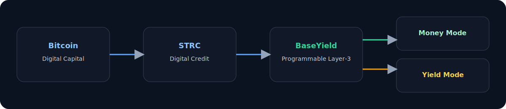

# BaseYield

Programmable Digital Money Built on Bitcoin Credit.

BaseYield is a Layer-3 financial product prototype built on a new stack:

- **Bitcoin** as digital capital
- **STRC** as digital credit
- **BaseYield** as programmable onchain wrappers on Base for digital money and digital yield

This repository is built for product exploration, architecture clarity, and accelerator-grade communication. It is **not** a production financial product and all outputs shown are simulated.

## Overview

Traditional finance is often built in layers: capital, credit, and financial products.  
BaseYield applies that same framing to crypto-native infrastructure:

1. Bitcoin anchors digital capital
2. STRC introduces a Bitcoin-linked digital credit instrument
3. BaseYield wraps digital credit into configurable onchain products on Base

The initial prototype demonstrates two modes:

- **Money Mode**: simulated 8-10% target range, higher stability, daily liquidity profile
- **Yield Mode**: simulated 15-25% target range, higher volatility/lockup profile

Future optional feature direction:

- **Bitcoin accumulation engine (optional)**: user-controlled setting to convert a chosen share of
  yield into BTC over time

## Stack Diagram

The thesis in one view:



## The Thesis

We believe the most durable crypto financial products will be built as transparent, programmable systems where users can explicitly choose tradeoffs among:

- Yield
- Liquidity
- Stability
- Reserve coverage

In this model, Base is the programmable distribution layer that can express these tradeoffs in software and smart contract logic.

## Product Modes

### Money Mode

- Simulated allocation:
  - 70% STRC exposure
  - 20% cash or treasury-style sleeve
  - 10% reserve buffer
- Simulated target APY range: 8-10%
- Lower volatility band
- Higher redemption flexibility
- Yield source: base STRC carry + reserve sleeve

### Yield Mode

- Simulated allocation:
  - 90% STRC exposure
  - 5% reserve buffer
  - 5% tactical yield sleeve
- Simulated target APY range: 15-25%
- Higher volatility band
- More constrained liquidity profile
- Yield source: base STRC carry + optional leverage/options overlays

## Why Base

Base provides a practical environment for launching programmable financial wrappers:

- Fast, low-cost execution
- Strong developer ecosystem and tooling
- Consumer-facing distribution potential
- Natural fit for modular product surfaces and onchain accounting

## Architecture

The repository includes:

- `apps/web` - Next.js + TypeScript + Tailwind landing page and prototype dashboard
- `contracts` - Hardhat Solidity scaffold for vaults and share token logic
- `docs` - Product vision, architecture, and phased roadmap
- `packages/ui` - Placeholder package for reusable component extraction

## Current Status

Implemented today:

- Polished landing page and app shell
- Prototype dashboard with simulated metrics
- Configurable reserve slider demonstrating programmable credit tradeoffs
- Mode-specific product cards (Money Mode vs Yield Mode)
- Solidity contract scaffold:
  - `BaseYieldVault`
  - `MoneyModeVault`
  - `YieldModeVault`
  - `VaultShareToken`

Not yet implemented:

- Real STRC integrations
- Real custody, brokerage, or redemption rails
- Mainnet deployments
- Production-grade risk engines or compliance stack

## Roadmap

1. **Phase 1**: Thesis demo and product prototype (current)
2. **Phase 2**: Testnet vault simulation and contract integration
3. **Phase 3**: Partner and offchain integration exploration
4. **Phase 4**: Regulated wrapper and distribution exploration

More detail: `docs/roadmap.md`

Application-facing narrative: `docs/application-thesis.md`

## Local Development

```bash
npm install
npm run dev
```

Open `http://localhost:3000`.

Useful commands:

```bash
npm run build
npm run lint
npm run contracts:compile
npm run contracts:test
```

## Disclaimer

BaseYield is an exploratory prototype for research, product design, and technical demonstration.  
All dashboard outputs are simulated and illustrative. Nothing in this repository constitutes financial, investment, legal, tax, or regulatory advice.
